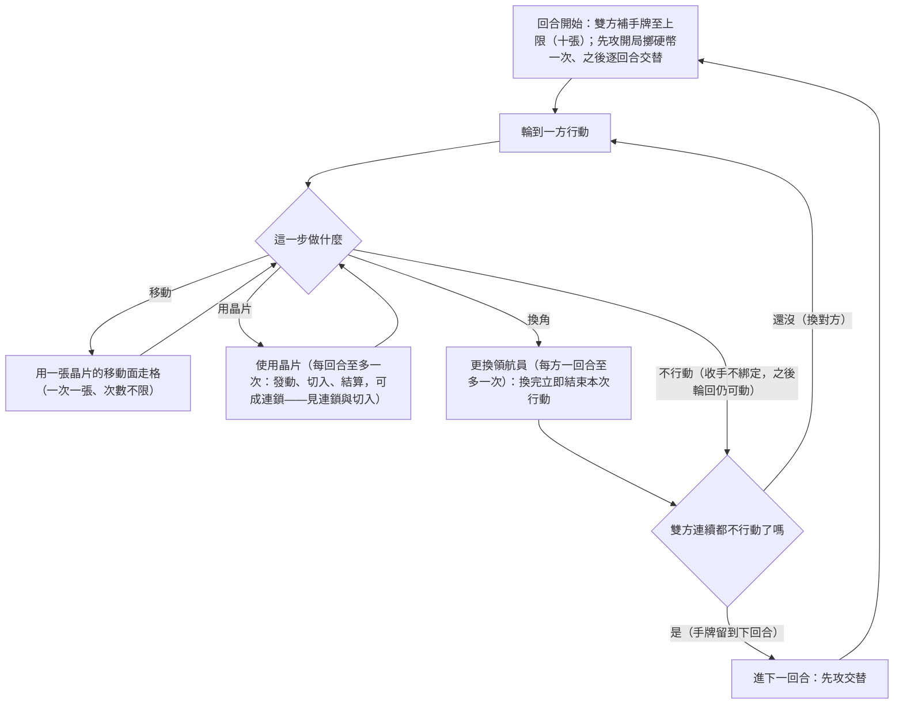

# 確立項:回合與行動

## 已確立

- **三層結構(2026-07-15 改制、晚間釐清)**:回合 ＞ 行動 ＞ 出牌。「回合」雙方共用;「**行動**」=一方的一次回合步——**使用晶片、移動一次、換角、不動作,都算一個行動**(user 釐清:時鐘口徑含不動作);「出牌」=單張晶片的發動與結算(使用晶片這種行動的內部)。投擲等「以行動計」的時鐘照此口徑。引用舊數據須確認語義(舊制行動=不限次的連續執行段)。
- **回合流程**:回合開始雙方補手牌至上限(**10 張=2026-07-18 拍**)→ 依先攻順序輪替執行行動 → **雙方都不行動則回合結束**(2026-07-11 拍、採最鬆敘述):輪到你時可以不行動;不行動**不綁定**——對方之後有行動、行動權輪回時你仍可再行動;雙方**連續**都不行動才進下一回合(手牌留到下回合)。
- **先攻**:開局擲硬幣一次(暫定),之後逐回合交替。**無後手洗回補償、雙方零起手調度**(2026-07-11 拍、**2026-07-18 複驗拍定維持**:交替單獨已把先手公平做滿,洗回補償反成後攻淨優勢;後攻本已微利=層2_21 同向;日後體感需要「壞手救濟」再議——證據=`4_驗證/層1_3_3_後攻微利拆解`)。
- **行動經濟(2026-07-15 拍、晚間釐清)**:
  - **使用晶片**:**每方每回合至多一次**——發動→(切入)→結算的完整過程,滿足代碼規則可連鎖多張(見 [[確立項_連鎖與切入]])。舊「一次行動內可開多個使用晶片段」**作廢**。
  - **移動**:**次數不限**(每回合無上限),但**每次移動=一個行動**(占一個輪替步)、消耗一張晶片的移動面。移動不在使用晶片過程內——舊「移動穿插中斷連鎖」條款**作廢**(連鎖住在使用晶片這一個行動之內,結構上插不進移動;迅捷等詞條內的移動=晶片效果、不在此限)。
  - **不動作**:也是一個行動(投擲等時鐘照計);**雙方連續不動作則回合結束**(收手不綁定沿用)。
  - **更換領航員**:一回合每方至多一次;**與使用晶片不互斥**(同回合可換角+使用晶片,2026-07-15 深夜拍;互動問題待測=步三)。
- 舊制「一回合固定 N 個行動」的行動槽框架**廢止**——資源分配的稀缺本體改由手牌承擔(手牌=行動預算、移動燃料、攻擊彈藥、切入子彈)。

## 回合迴圈一張圖

雙層嵌套迴圈:外圈=回合(補牌與先攻交替)、內圈=行動輪替(直到雙方都結束):

## 設計意圖

行動槽換成手牌經濟後,題1(行動經濟)與題3(晶片供給)合流:供給節奏直接決定每回合能做幾件事。**使用晶片一回合一次(2026-07-15)=連鎖成為整回合的輸出上限**——「留牌湊長鏈」自此有結構性報酬;搶攻(靠多次行動灌傷害)釜底抽薪。此裁決=連鎖誘因方向拍板,證據=層2_5/2_5_1/1_8/2_6(舊制下搶攻輾壓、鏈長獎勵貼皮死路)。「收手留牌」保的是質不是量(補至上限制下留牌不增張數,留的是特定代碼組合)——藏連鎖零件本身就是訊號與讀心材料。交替先攻是舊驗證對「累積型先手病」的對症候選;切入權讓後攻方在對方行動中也有戲,結構上天然削先手(量級待測)。

## 未定與掛靠

- ~~手牌上限正式值(暫定 8)~~✅(10=2026-07-18 鏈過短聯集拍定)、牌庫張數 → [[題3_晶片供給]]
- 觀察條款:風箏消耗戰——**已測(層1_4,2026-07-11):不氾濫、自懲**(勝率 33–40%、不拖局、上限零觸發)→ **行動數上限旋鈕不啟用**;綁該版風箏駕駛,更強風箏=層2 演化 exploit 再驗
- 觀察條款:**綁定收手變體**(宣告結束=鎖定本回合,vs 現行不綁定)→ 未來待測(2026-07-11 拍現行=不綁定)
- 換角一場總上限 → [[題2_隊伍規模]]
- 終局保證(模型暫用回合上限當實驗值)→ [[題7_對局長度]]

## 拍板紀錄

- 2026-07-03:user 確立輪流制與行動種類清單。
- 2026-07-18(題3 場):**起手調度拍定=維持雙方零調度**(洗二不回鍋;證據=層1_3_3 洗二過補＋層2_21 後攻本已微利、公平觀丙案同向;「壞手救濟」留體感再議)。
- 2026-07-18:**鏈過短聯集拍定——手牌上限 8→10（配套工作點 HP350）＋佔領(整欄)移碼 K→Q（治理A、白嫖收口）**;證據=[[鏈過短_1_0_鏈過短矩陣]](兩帖藥正交:鏈 2.33→2.74 全來自手10×HP350、白嫖 53.2→51.1 全來自治理A);切入密度 +54%=U21 觀察權重升。
- 2026-07-10:user 拍新回合結構——手牌驅動(暫定 8)、雙方輪替行動至雙方結束、先攻開局擲一次後逐回合交替、後手第一回合洗回兩張、移動單次單張不限次、換角混入行動但換完即結束且一回合一次。
- 2026-07-11:user 拍**收手語義=不綁定**(「雙方都不行動則回合結束」=最鬆敘述;收手後對方有行動、輪回仍可再動——後發博弈成立,風箏打法的前提)。**綁定收手變體(宣告結束=鎖定本回合)=未來待測**(掛觀察條款;層1_4 起的對局數差異可當證據)。
- 2026-07-15:user 拍**行動經濟改制**——「使用晶片」每方每回合至多一次(可連鎖延長)、移動不限次(每次仍消耗一張)、「多使用晶片段」與「移動穿插中斷連鎖」作廢。方向依據=連鎖誘因四份證據。工作單=`9_系統/進度_行動經濟與切入堆疊改制_2026-07-15.md`。
- 2026-07-15(深夜、未知矩陣 U 系列):**行動定義釐清**=出晶片/移動/不動作/換角皆算一個行動(Claude 曾誤讀為「行動=使用晶片」、已更正);移動每次占一個輪替步;換角與使用晶片同回合不互斥(待測);收手判定=雙方連續不動作(U8 隨之解)。
- 2026-07-11:user 拍**拿掉洗二**(暫定 0 張)——層1_3_3:交替單獨=公平(洗二 0 時先攻 48.8–50.4%)、洗二疊上=後攻淨優勢 1–4 點(過補);固定先攻對照 66–73% 證明交替是公平主承重牆、「資訊尾勝」假說否定。引擎開關(mulligan_n)保留供對照。
