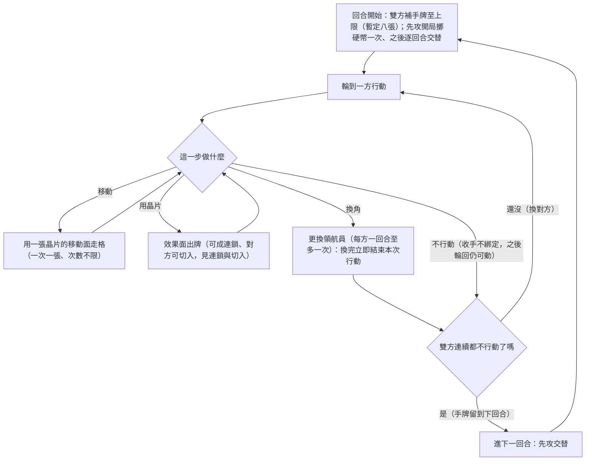

# 確立項:回合與行動

## 已確立

- **三層結構**:回合 ＞ 行動 ＞ 出牌。「回合」是雙方共用的週期,「行動」是一方的連續執行段,「出牌」是單張結算(連鎖與切入住這層,見 [[確立項_連鎖與切入]])。引用任何以「回合」計的舊數據須先確認語義(舊制回合=一人行動段)。
- **回合流程**:回合開始雙方補手牌至上限(暫定 8 張)→ 依先攻順序輪替執行行動 → **雙方都不行動則回合結束**(2026-07-11 拍、採最鬆敘述):輪到你時可以不行動;不行動**不綁定**——對方之後有行動、行動權輪回時你仍可再行動;雙方**連續**都不行動才進下一回合(手牌留到下回合)。
- **先攻**:開局擲硬幣一次(暫定),之後逐回合交替。**無後手洗回補償**(2026-07-11 拍、暫定:交替單獨已把先手公平做滿,洗回補償反成後攻淨優勢;日後體感需要「壞手救濟」再議——證據=`4_驗證/層1_3_3_後攻微利拆解`)。
- **行動**:移動與使用晶片可自由排列組合,做完換對方。
  - **移動**:一次移動消耗一張晶片(用其移動面),一次行動內移動次數不限。
  - **使用晶片**:原則上一次一張;滿足連鎖可多張。一次行動內可開多個使用晶片段(移動、用晶片成鏈、再移動、再用晶片)。
  - **更換領航員**:可混在行動中,但換完立即結束該次行動;一回合每方至多一次。
- 舊制「一回合固定 N 個行動」的行動槽框架**廢止**——資源分配的稀缺本體改由手牌承擔(手牌=行動預算、移動燃料、攻擊彈藥、切入子彈)。

## 回合迴圈一張圖

雙層嵌套迴圈:外圈=回合(補牌與先攻交替)、內圈=行動輪替(直到雙方都結束):

## 設計意圖

行動槽換成手牌經濟後,題1(行動經濟)與題3(晶片供給)合流:供給節奏直接決定每回合能做幾件事。「收手留牌」保的是質不是量(補至上限制下留牌不增張數,留的是特定代碼組合)——藏連鎖零件本身就是訊號與讀心材料。交替先攻是舊驗證對「累積型先手病」的對症候選;切入權讓後攻方在對方行動中也有戲,結構上天然削先手(量級待測)。

## 未定與掛靠

- 手牌上限正式值(暫定 8)、牌庫張數 → [[題3_晶片供給]]
- 觀察條款:風箏消耗戰——**已測(層1_4,2026-07-11):不氾濫、自懲**(勝率 33–40%、不拖局、上限零觸發)→ **行動數上限旋鈕不啟用**;綁該版風箏駕駛,更強風箏=層2 演化 exploit 再驗
- 觀察條款:**綁定收手變體**(宣告結束=鎖定本回合,vs 現行不綁定)→ 未來待測(2026-07-11 拍現行=不綁定)
- 換角一場總上限 → [[題2_隊伍規模]]
- 終局保證(模型暫用回合上限當實驗值)→ [[題7_對局長度]]

## 拍板紀錄

- 2026-07-03:user 確立輪流制與行動種類清單。
- 2026-07-10:user 拍新回合結構——手牌驅動(暫定 8)、雙方輪替行動至雙方結束、先攻開局擲一次後逐回合交替、後手第一回合洗回兩張、移動單次單張不限次、換角混入行動但換完即結束且一回合一次。
- 2026-07-11:user 拍**收手語義=不綁定**(「雙方都不行動則回合結束」=最鬆敘述;收手後對方有行動、輪回仍可再動——後發博弈成立,風箏打法的前提)。**綁定收手變體(宣告結束=鎖定本回合)=未來待測**(掛觀察條款;層1_4 起的對局數差異可當證據)。
- 2026-07-11:user 拍**拿掉洗二**(暫定 0 張)——層1_3_3:交替單獨=公平(洗二 0 時先攻 48.8–50.4%)、洗二疊上=後攻淨優勢 1–4 點(過補);固定先攻對照 66–73% 證明交替是公平主承重牆、「資訊尾勝」假說否定。引擎開關(mulligan_n)保留供對照。
