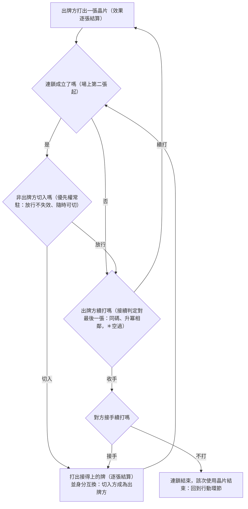

# 確立項:連鎖與切入

## 已確立

- **代碼欄**:每張晶片印一個代碼(字母或＊)。**術語(2026-07-11 統一)**:印字母的叫**字母牌**(A–M)、印＊的叫**米號牌**,「代碼」為兩者總稱。代碼只在**效果面**使用時有意義;移動面不涉代碼——不延續連鎖、不能作為切入,連鎖中穿插移動即中斷連鎖。層級:**使用晶片 ＞ 連鎖 ＞ 切入**,各為上一層的子情況。
- **連鎖判定**:接續判定永遠對「最後落地的一張」算,滿足兩規則之一即可——**同代碼**,或**順序升冪相鄰**(跳字、降冪不合法)。＊可隨意穿插且算**空過**:參照牌跳過＊、對＊之前那張算(A→B→＊之後仍須 C);**＊的出現不改變進行中的連鎖規則**——＊起手時之前是開鏈狀態,下一張即視為開鏈首張實碼(2026-07-11 裁定)。
- **切入(cut-in)**:連鎖成立後(第二張起)才可切入;單張使用不可被切入。切入＝非出牌方打出接得上當前序列的牌,發動其效果面。
- **連鎖成立的數法(2026-07-11 拍板)**:「第二張」照**落地張數**數,米號牌也算一張——字母牌＋米號牌=兩張即成立,切入時機與收手後的接手窗同時開啟(兩者同一門檻)。連鎖裡還沒出過字母牌時(例如起手連兩張米號牌),參照為空——**任何代碼都可以切入**。
- **優先權**:連鎖進行中,優先權**恆屬於非出牌方**——常駐的切入選擇權。出牌方每打出一張,非出牌方都可選擇切入或放行;放行**不消耗權利**(這張不切、下張仍可切,包括「我的牌到對方連鎖第二、三張才接得上」的情況)。切入一旦發動,身分互換:切入方成為出牌方展開連鎖,原出牌方轉為非出牌方持優先權、可隨時切回。如此遞迴,直到雙方都不出牌。
- **結算**:連鎖內效果**逐張即時結算**。連鎖結束,該次「使用晶片」結束,回到行動環節。

## 出牌迴圈一張圖

每張牌落地後的完整詢問順序(引擎的出牌迴圈同構,見 `9_系統/模型規格_sim_v2.md` §一):

## 設計意圖

連鎖自帶風險軸:出單張慢但安全(不可被切入),連鎖一個行動多張高效率、但每張都是對方的介入窗。切入使隱藏手牌在每次出牌都被讀(「他握著什麼碼」),是猜想支柱的主載體。＊是萬用介入子彈——「好湊本身就是強」的舊坑集中於此,＊卡的效果強度上限必須壓低(池形狀硬約束)。

## 未定與掛靠

- 代碼規模正式值(暫定 A–M 十三碼＋＊,即原作字母碼的緊縮版)→ [[題3_晶片供給]];模型層0 測試回填
- 升降冪不對稱變體(優先權方可升降、對方只能升)→ 登記待測,見 [[1_準確立層]] 觀察條款
- 基礎晶片的代碼分配 → 池形狀第一題

## 拍板紀錄

- 2026-07-10:user 拍連鎖與 cut-in 全套——代碼欄、兩條接續規則(同碼/順序升冪相鄰)、＊空過、切入資格第二張起、逐張結算、移動穿插中斷、層級「使用晶片＞連鎖＞切入」。
- 2026-07-11:優先權語義定案(恆屬非出牌方、常駐可選發、放行不失效)。
- 2026-07-11(二):切入時機計數拍板——連鎖成立照落地張數、米號牌算一張(字母牌＋米號牌=兩張即可切入);參照為空時任何代碼皆可切入。術語統一:字母牌/米號牌,「代碼」為總稱。米號牌張數檔位待測(0/3/5/不限,見 4_驗證/層0_2_米號牌與切入時機)。
