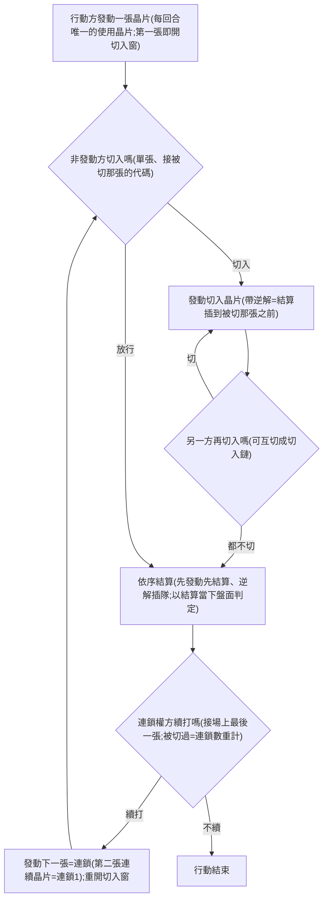

# 確立項:連鎖與切入

## 已確立

- **代碼欄**:每張晶片印一個代碼(字母或＊)。**術語(2026-07-11 統一)**:印字母的叫**字母牌**(A–Z)、印＊的叫**米號牌**,「代碼」為兩者總稱。代碼只在**效果面**使用時有意義;移動面不涉代碼。層級:**使用晶片(行動)＞ 連鎖 ＞ 切入**——連鎖=行動方的延長線、切入=非發動方的回應。
- **兩步結算(2026-07-15 拍)**:每張晶片的使用分「**發動**」與「**結算**」兩步。發動=宣告出牌、開啟對方的切入窗;結算=效果生效,**以結算當下的盤面判定**(命中、範圍、位置)——發動到結算之間的空窗是真實的:先結算的位移可使後結算的晶片落空。舊「逐張即時結算」作廢。
- **接續判定(代碼規則,沿用)**:對「場上最後發動的一張」算(含切入晶片),滿足其一——**同代碼**或**順序升冪相鄰**(跳字、降冪不合法)。＊空過照舊:參照跳過＊、對＊之前那張算(A→B→＊之後仍須 C);＊不改變進行中的連鎖規則(2026-07-11 裁定)。
- **連鎖(2026-07-15 改制)**:連鎖=**行動方(保有連鎖權者)自身兩張連續晶片間**的過程,只有行動方能連鎖。**計數:第二張連續晶片=連鎖1**,依此類推。**被切入即中斷**:連鎖被切入後中斷;切入結算完成後連鎖權方仍可續打,但屬**新連鎖、連鎖數重新起算**。
- **切入(2026-07-15 改制)**:任何晶片發動後(**含行動的第一張**)、結算前,**非發動方**可切入——發動一張接得上的晶片(**單張**、參照=被切那張)。切入晶片發動後,換另一方決定是否再切入(可反覆互切=**切入鏈**);**雙方都不再切入時,依序結算**;結算完成後連鎖權方可續連或結束——不續連且無人切入=該次行動(使用晶片)結束。切入**不消耗**「每回合一次」的使用晶片權;**切入用的晶片不限攻擊面**(2026-07-15 深夜拍 U1=全開放:任何效果面接得上就可切、靠手牌經濟自限——回復/佔領/強化藉切入出場的白嫖風險=步三 exploit 掃描項)。舊制**作廢**:優先權恆屬非出牌方/身分互換/接手(2026-07-11 版)、「第二張起才可切入/單張不可被切入」門檻。
- **結算順序(2026-07-15 拍「換位法」)**:基準=**發動順序**(先發動先結算);帶**逆解**的切入晶片(定義見 [[確立項_晶片]])於發動時**換位**到被切晶片之前——逆解=「優先被結算權」、是**換位**不是逆向;**無逆解的切入位置不動、照發動序**。例:X→帶逆解的Y切X→無逆解的Z切Y ⇒ 結算 **Y→X→Z**(Z 沒有先結算的權力);全逆解互切 ⇒ 逐張換位、後切者先結算(W→Z→Y→X)。**擊殺截斷(2026-07-16 拍 U22)**:結算進行中若一方死亡(勝負已定),該批**已發動、未結算**的晶片一律**作廢進棄牌堆**、效果不生效。
- **快手(2026-07-15 改義)**:帶快手詞條的晶片**不可被切入**(它的發動不開對方切入窗)——舊「落地至下張前不可切」在兩步制下的映射。**作為切入發動時=封門**(2026-07-15 確認):後面無人能再切、切入鏈就此打住、直接進入結算。
- **代碼規模=26 碼(A–Z)+米號(2026-07-13 拍)**:承接孤立碼與預留碼位需求(v6 用到 P/R/Z);鏡像共用夾下字母表大小近零影響、影響在未來構築生態(層0_4:26 碼被切率 95→68)。

## 出牌迴圈一張圖

一次「使用晶片」(=行動)的完整流程(2026-07-15 改制;時序實例見下方軸線圖):

![[DIGO_EXE_發動結算軸線.png]]

## 設計意圖

使用晶片一回合一次之後,**連鎖=整回合的輸出上限**——留牌湊長鏈第一次有結構性理由(層2_5/2_6:舊制下等大鏈純虧)。切入的價值軸翻新:**打斷對方連鎖計數**+插隊改盤面;逆解把「發動—結算空窗」變成博弈面(互切軍備競賽中後切者先結算、但先結算的位移會讓後面整串落空=自帶剎車)。切入使隱藏手牌在每次出牌都被讀,仍是猜想支柱主載體;＊是萬用介入子彈、＊卡效果強度上限壓低的池形狀硬約束照舊。

## 未定與掛靠

- 米號牌張數正式值(v6 現行 4 張=題3 旋鈕)→ [[題3_晶片供給]]
- 升降冪變體(自由/不對稱=僅切入方可降)→ **已測(層2_17、2026-07-17):兩檔鏈均皆反降=切入資格同步放寬、拆鏈面吃得更多——維持僅升冪**;發想條目([[發想_連鎖升降冪變體]])等 user 拍後封存
- 基礎晶片的代碼分配 → 池形狀第一題

## 拍板紀錄

- 2026-07-10:user 拍連鎖與 cut-in 全套——代碼欄、兩條接續規則(同碼/順序升冪相鄰)、＊空過、切入資格第二張起、逐張結算、移動穿插中斷、層級「使用晶片＞連鎖＞切入」。
- 2026-07-11:優先權語義定案(恆屬非出牌方、常駐可選發、放行不失效)。
- 2026-07-11(二):切入時機計數拍板——連鎖成立照落地張數、米號牌算一張(字母牌＋米號牌=兩張即可切入);參照為空時任何代碼皆可切入。術語統一:字母牌/米號牌,「代碼」為總稱。米號牌張數檔位待測(0/3/5/不限,見 4_驗證/層0_2_米號牌與切入時機)。
- 2026-07-13:代碼規模拍 26 碼(A–Z);快手=優先權首個豁免——EXE3 對接批次十輪拍板。
- 2026-07-15(晚):**逆解鏈拍「換位法」**(基準=發動序、逆解者換位到被切之前、無逆解者不動;混合例 Y→X→Z)+**快手=切入封門**確認。
- 2026-07-16:**擊殺截斷拍板(U22,步二窮舉衝出的條文缺口)**——結算中一方死亡,餘串已發動未結算晶片作廢進棄牌堆、效果不生效(user 認可引擎暫行語義;1v1 下死亡=終局、3對3 換角世界才有實感,層3 驗收複驗)。
- 2026-07-15:user 拍**切入堆疊改制**——兩步結算(發動/結算、結算以當下盤面判定)、切入窗自第一張起且雙向(互切成切入鏈、雙方停手才依序結算)、連鎖=行動方自身連續晶片(第二張=連鎖1、被切入即中斷且重計)、逆解詞條(插到被切晶片之前)、快手改義(不可被切入);舊優先權制/「第二張起可切入」/「逐張即時結算」/「移動穿插中斷」全數作廢。實例與逆解鏈形式化提案=`9_系統/進度_行動經濟與切入堆疊改制_2026-07-15.md`。
