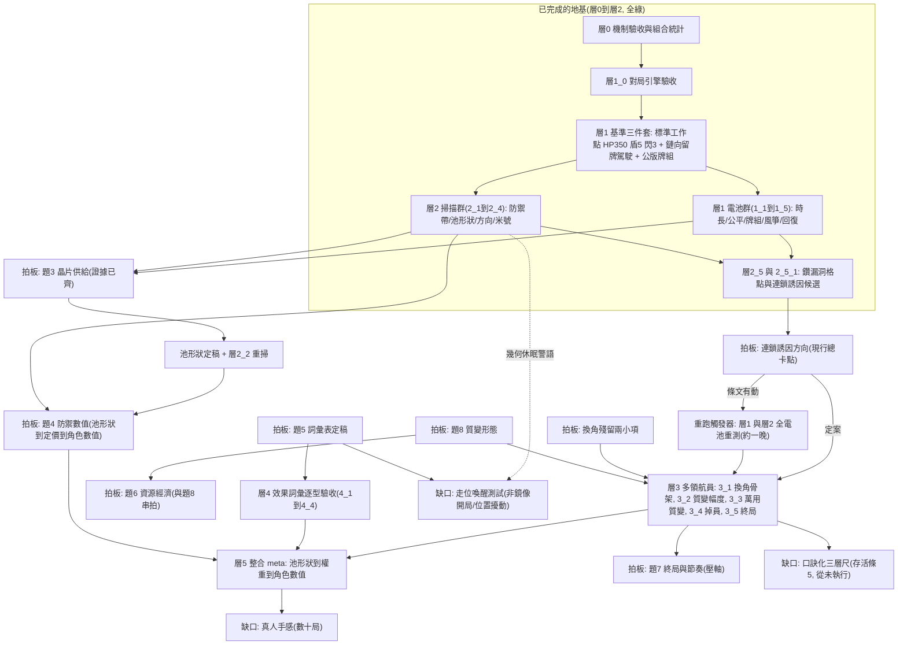

# 驗證索引

> 證據層:拍板不靠手感、靠數據(工作準則見專案 CLAUDE.md「數值以模擬器為準」)。**2026-07-11 新制分界**:手牌驅動回合制＋連鎖切入＋閃避額度消耗上線後,本資料夾分兩區——**活區**(傷害核心數學,綁確立項沿用)與 **`_歷史/`**(三波舊框架驗證:行動槽/超額削減/舊帶值語義)。sim_v2 新結果=層N_序_名稱(子測試 層N_序_子序);頂部固定 0_索引/1_名詞解釋/2_模組定義/3_傷害模型。

## 活區

| 檔案 | 它是什麼 | 支撐什麼 |
|---|---|---|
| [[1_名詞解釋]] | 測試共用名詞(六量/量測口徑/相關性/打滿假設…) | 讀任何測試報告前的共同語言;新名詞先入此檔 |
| [[2_模組定義]] | 模組化變因:駕駛五檔(含風箏/回復優先)/公版牌組詳表(傾向測試基底)/組牌傾向五型＋平衡型 v2(傾向家族特例) | 測試的可掛載模組;結論引用一律標駕駛與組成 |
| [[3_傷害模型]] | 傷害子系統合併檔:模型+實測紀錄+線圖(2026-07-11 三檔併一) | 引擎 resolve_attack 骨架;題4 數學地基與帶值參考(閃避線=無消耗舊語義,額度版待重繪) |
| [[層0_1_連鎖組合與結算]] | 層0:驗收 33 項＋連鎖組合數學＋死角矩陣(模板回填實例) | sim_v2 引擎的條文驗收;代碼規模/帶值方向 |
| [[層0_2_米號牌與切入時機]] | 層0 補測:米號牌語義驗收＋張數掃描(首個原生模板工序實例) | 切入計數甲案(2026-07-11 拍)的驗收;米號牌張數與定價的拍板素材 |
| [[層0_3_組牌傾向與相關性]] | 層0 補測:組牌傾向四原型×相關性兩檔(地板版) | 題3 組牌傾向/代碼規模前置;層1.3 牌組電池的預期素材 |
| [[層0_4_代碼子系統總掃描]] | 層0 總掃描:六量×六變因 86 格+主宰因子表 | 題3 全案(規模/組牌傾向/米號/複本)的層0 證據基礎;成鏈率非旋鈕、鏈長剎車可被梯隊繞過、米號=切入總開關 |
| [[層1_0_引擎驗收]] | 層1 對局引擎(盤面/回合迴圈/連鎖切入整合)20 項驗收 | 層1 起所有對局統計的地基;引擎 l1_game.py |
| [[層1_1_回合迴圈收斂]] | 標準工作點×閃避掃描(正文)+歷史輪次沿革 | 標準工作點(HP350/**標準檔閃3**)=中位 8、鏈均 3.2、切入 12(全帶 6–10);上限 30 餘裕大 |
| [[層1_1_1_時長調校]] | 層1_1 子測試:假體 HP 下掃九檔×閃避五檔(目標帶 6–9) | **工作點拍定=HP350**(帶 6–10 底對齊);後攻微利與局長解耦;斬殺邊界 325–300;題7/題2/題4 尺度素材 |
| [[層1_2_先手公平]] | 先攻優勢軌跡:舊制+15.5→貪婪≈0→留牌 −2~−4→拿掉洗二=歸零 | 題1 收官;微利已拆(=洗二過補,層1_3_3)、現行條文 48.8–50.4% |
| [[層1_3_1_平衡型調鏈長]] | 鏈均長調校:組成五變體×駕駛三檔 | 定稿=鏈向留牌(層1 量測標準)×平衡型 v2;「收手留牌」價值首次量化;組成非槓桿 |
| [[層1_3_2_牌組組法電池]] | 六構築鏡像+異構 15 配對(公版牌組、對局版口徑、逐回合六量) | 相剋表(公版)=集中79≈梯隊78>>分散47>互異41>平衡32>疏離23(鏈長節奏主宰、平衡型第五);異構切入崩=代碼重疊是切入總開關;米號囤積效應;題3 主證據 |
| [[層1_3_3_後攻微利拆解]] | 洗二張數 0–3×先攻交替開關×閃避四檔(引擎開關+驗收 4 項) | 微利主要=洗二過補(0 張≈50、第 1 張即飽和;標準檔閃3 現行=49.1 已近公平);交替=公平主承重牆(固定先攻 66–73%);資訊尾勝死亡;洗二張數=拍板素材 |
| [[層1_4_風箏消耗戰]] | 六構築×(風箏 vs 鏈向留牌)+鏡像基準對照(12 格、公版) | 風箏自懲(33–41%)、拖長 1–3 回合但遠離上限→行動數上限旋鈕不啟用;「拆大連鎖」反轉=囤牌紅利(5+ 鏈率翻 1.3–3.5 倍);補滿制無手滿狀態 |
| [[層1_5_回復收斂]] | 回復濃度 4 檔×回復每局上限開關×駕駛配對 3 檔(30 格;公版主格+平衡型錨定) | 高濃度+全洗回=不收斂(回復 3 種=平局 24–30%);**主動回復=壓倒性優勢策略(97–100%,現行牌組即成立)**——行動不限次+洗回=零機會成本;上限2 治標且高濃度死牌塞手(平局 97%)→回復管制走題3 濃度/題4 定價或行動面條文(待拍);題7 上限風險素材 |
| [[層2_1_防禦帶掃描]] | 閃 0–4×盾 0–20×場 0/5/10=75 變體各 vs 標準假體+鏡像牆 4 格(公版分散) | **力場一步=半場勝負**(場0→5:50→98.6%、名目蒸發 41%;場10=絕對牆);盾 5→10=+30 後飽和;閃避=三軸最弱(每點 +5~13 遞減);加性預算崩壞(R²=0.64)→題4 改逐軸帶值+池形狀共拍;單側牆不拖局、鏡像牆才拖(場10 鏡像 4.7%、全牆 86% 平局) |
| [[層2_3_方向自由度對照]] | 僅升冪/自由/不對稱×六構築鏡像=18 格(track 對局版口徑) | 體感旋鈕非平衡旋鈕:切入 +0.5~2.3/場(資格 +7~18 點)、鏈均 +0.2~0.6,時長與先攻全不動;梯隊/平衡最有感、疏離免疫;**不對稱≈自由九成**(降冪切入反幫出牌方續鏈)→觀察條款可維持僅升冪、要加互動先試不對稱 |
| [[層2_4_米號強度電池]] | 米號張數 0–8×強度 弱/次/中/強 鏡像 20 格+定價面 9 格(vs 現行弱3) | **兩軸分工乾淨**:張數=互動密度(切入 10.7→15.0)、強度=勝負;定價安全帶量化=**米號名目 ≤10~15(池均之半)**——名目 20=訊號區(56–58%、8 張稀釋自傷)、名目 30 起明確超標(61–67%)、50=70–80%;稀釋效應=天然護欄;題3 池硬約束回填 |
| [[層2_2_池形狀初掃]] | 逐卡使用面四路+實效稅+勝敗差×兩池(公版分散/平衡型) | **實效稅表**:單次5 多發只剩名目 34–39%(盾5=懸崖)、大單發 65–71%;廢牌=實效帶(機關槍/洛克砲(連射)/速射)+殘手戶(治癒 2.21/場、突進零使用);使用率在品質盲駕駛下無資訊量;**幾何休眠**:鏡像同排開局=移動子系統全休眠、層1 鏡像數據對移動力零敏感(題5 引用警語) |
| [[層2_5_駕駛exploit格點]] | 出手門檻 1–4×切入策略 3 檔×回復優先 2 檔=24 變體 vs 標準駕駛 | ⚠️ **核心設計缺口實錘:連鎖無機制紅利→「不留牌搶攻」91–94% 輾壓留牌標準、「不切入」+19 點(69.7%)、三軸疊加 100%**;最優 meta=中位 3–4 回合、鏈均 2.4(目標帶反面);切入密度舊數字=反最優行為產物;待拍=連鎖誘因四候選+切入誘因三候選(→層2_5_1 已實測解法) |
| [[層2_5_1_連鎖誘因候選掃描]] | 條文候選 9 檔+組合 3 檔×(搶攻vs留牌/留牌鏡像)=24 格 | **全數不及格**:加成反效果(幫搶攻、對局壓到 2–3 回合)、行動上限1=78%、補牌上限2=69% 但節奏毀、最強組合 64%;**病根=殘手單張流量差一倍,位階獎勵與流量剎車都補不回**;可行解=質變級(單張懲罰/連鎖乘法/接受競速改目標帶)=品味裁決、先於題3 拍 |
| (續編) | sim_v2 測試階梯結果(規格:`9_系統/模型規格_sim_v2.md` §六) | **命名=層N_序_名稱**、子測試再加一層(層N_序_子序_名稱);逐層落檔 |

## `_歷史/`(舊框架三波,2026-07-05–10)

導讀與結論五檔+三個存檔夾整包封存:4/5(三方向)、6/7(第二波)、8(機率制重跑)。

**引用守則**:
- **機制性洞察仍可援引**——安全網病根=幾何拒止而非拖延、定價迴歸方法、三層驗收尺、換角回復牆的結構性論證等。
- **絕對數字一律標舊語義**,不可直接套新制(行動槽/無消耗閃避/舊帶值/舊「回合」定義)。
- 要從存檔撈殘值,先過 `_歷史/_機率制重跑存檔/F1_數字宣稱校核.md` 與 `F1_程式路徑校核.md`——這批資料自身的可信度裁決表。
- 換角條文**活檔**:`_歷史/_第二波驗證存檔/裁量_B1.md`(確立項與題4 引用;「閃避無狀態」一條已被額度制取代)。

## 層×題對照(收攏版,2026-07-11 user 指示)

> 階梯定義的權威=`9_系統/模型規格_sim_v2.md` §六;變因側的掛題=框架 §四。**這張表是「哪個測試餵哪個題」的唯一總覽**,新測試落檔即補一列。

| 階梯項             | 測什麼                      | 掛哪題                               | 狀態/結果                                                                 |
| --------------- | ------------------------ | --------------------------------- | --------------------------------------------------------------------- |
| 層0.1/0.2/0.4 驗收 | 引擎=條文(連鎖/迴圈/結算)          | —                                 | ✅ [[層0_1_連鎖組合與結算]]                                                    |
| 層0.3 連鎖組合       | 成鏈率/成鏈度(第一手地板)           | 題3 代碼規模                           | ✅ 同上(拍板等層1.3)                                                         |
| 層0.5 死角矩陣       | 閃避額度×力場門檻                | 題4 帶值                             | ✅ 同上                                                                  |
| 層0 補測:米號        | 米號語義驗收+張數掃描              | 題3 米號張數(切入普及度總開關)                 | ✅ [[層0_2_米號牌與切入時機]]                                                   |
| 層0 補測:組牌傾向      | 傾向×相關性(地板)               | 題3 組牌傾向                           | ✅ [[層0_3_組牌傾向與相關性]]                                                   |
| 層0 總掃描          | 六量×六變因主宰因子表              | 題3 全案+題4 方向                       | ✅ [[層0_4_代碼子系統總掃描]]                                                   |
| 層1.0 引擎驗收       | 對局引擎=條文(25 項)            | —                                 | ✅ [[層1_0_引擎驗收]]                                                       |
| 層1.1 回合收斂       | 對局長度/上限/無限局              | 題7 終局;題2/4 HP 尺度                  | ✅ [[層1_1_回合迴圈收斂]] (HP350 工作點=6–10 回合帶)                                 |
| 層1.1.1 時長調校     | 假體 HP→回合帶(工作點下修至 6–9)    | 題7 時長;題2/4 HP 尺度                  | ✅ [[層1_1_1_時長調校]] (拍定 HP350)                                           |
| 層1.2 先手公平       | 先攻勝率                     | 題1 收官驗證                           | ✅ [[層1_2_先手公平]] (歸零)                                                   |
| 層1.3 牌組電池+逐回合六量 | 傾向×配對(切入率/被切入率雙向)+對局狀態六量 | 題3 正式拍板證據(規模/傾向/米號);題1 收官補遺(洗二張數) | ✅ 全結:1_3_1 調鏈長/ [[層1_3_2_牌組組法電池]] (相剋表)/[[層1_3_3_後攻微利拆解]] (→拍拿掉洗二,先攻歸零) |
| 層1.4 風箏消耗戰      | 行動數上限旋鈕探測(user 定義=放風箏打法) | 觀察條款                              | ✅ [[層1_4_風箏消耗戰]] (旋鈕不啟用;斷鏈直覺反轉)                                        |
| 層1.5 回復收斂       | 回復濃度×全洗回                 | 題3/題7                             | ✅ [[層1_5_回復收斂]] (不收斂證實;主動回復=優勢策略 97–100%;上限旋鈕不建議啟用)                    |
| 層2.1 防禦帶掃描      | 閃/盾/場帶值(n=2000)          | 題4                                | ✅ [[層2_1_防禦帶掃描]] (力場一步=半場勝負;閃避最弱;加性尺崩壞)                               |
| 層2.2 池形狀初掃      | 廢牌偵測/均衡權重                | 題3/題4                             | ✅ [[層2_2_池形狀初掃]] (實效稅表;盾5=單次5 懸崖;幾何休眠警語)                              |
| 層2.3 方向自由度對照    | 僅升冪 vs 自由 vs 不對稱         | 觀察條款                              | ✅ [[層2_3_方向自由度對照]] (體感旋鈕;不對稱≈自由九成;可維持僅升冪)                             |
| 層2.4 米號強度電池     | ＊濃度×效果定價                 | 題3(池硬約束)                          | ✅ [[層2_4_米號強度電池]] (安全帶=名目 ≤池均之半;張數=互動軸) |
| 層2.5 演化駕駛 exploit | 拖延/更強風箏/切入時機的演化搜尋 | 觀察條款複驗(風箏=層1_4、拖延=舊框架殘題) | ✅ [[層2_5_駕駛exploit格點]] (⚠️ 搶攻輾壓留牌 91%+;連鎖誘因=核心缺口,見 2_5_1) |
| 層2.5.1 連鎖誘因候選 | 加成/行動上限/補牌損耗×搶攻壓制 | **連鎖誘因(新拍板題材料、先於題3)** | ✅ [[層2_5_1_連鎖誘因候選掃描]] (全數不及格;可行解=質變級、等拍) |
| 層3.1–3.5 多領航員   | 換角/質變/掉員/終局              | 題2/題8/題7                          | 排定(質變等題8)                                                             |
| 層4 效果詞彙         | 逐型開放驗收                   | 題5/詞彙表                            | 排定                                                                    |
| 層5 整合 meta      | 池形狀→權重→角色數值              | 題4 角色數值                           | 排定                                                                    |

## 測試依賴圖與前置需求（先測什麼、才能測什麼）

> 2026-07-12 建：把階梯（模型規格 §六）、層×題表與各報告的「等拍再測」判斷收成一張依賴圖——**看圖找「進邊全數滿足的節點」＝當下可動工的事；「缺口」節點＝未來拓展方向**。維護規則：新測試落檔＝層×題表補一列＋本圖補節點與邊；拍板落檔＝對應閘門節點改註「已拍」。

### 讀圖三句話

- 已完成地基（層0–2）之後，**每條前進路徑都先經過一個拍板閘門**——四個可立即動的閘門（連鎖誘因／題3／題8／換角殘留）全都不缺證據、缺的是裁決：現階段瓶頸在決策、不在算力。
- 連鎖誘因是總卡點：層3 等它定案才開（否則白測）；若拍出新條文，層1–2 全電池要重跑（腳本在庫、約一晚）。
- 「缺口」節點＝階梯之外、看圖才浮出的拓展方向：走位喚醒（幾何休眠的解除法）、口訣化三層尺（存活條 5）、真人手感。

### 前置需求表（逐項寫「缺什麼才能動」）

| 下一步 | 前置（缺什麼） | 完成後解鎖 |
|---|---|---|
| 拍板：連鎖誘因方向 | 無——證據已齊（[[層2_5_駕駛exploit格點]]、[[層2_5_1_連鎖誘因候選掃描]]） | 層3 開跑；條文有動→層1–2 電池全重跑 |
| 拍板：題3 晶片供給 | 無——證據已齊（層0_2/0_3/0_4＋層1_3_2＋層1_5＋層2_2/2_4） | 池形狀定稿、層2_2 重掃、題4 的前置 |
| 拍板：題8 質變形態 | 無測試前置（品味裁決） | 層3_2/3_3、引擎質變池定義、題6 串拍 |
| 拍板：換角殘留兩小項 | 無 | 層3_1 |
| 層3_1 換角骨架 | 連鎖誘因定案＋換角殘留拍板 | 層3_2、層3_4 |
| 層3_2 質變幅度 | 層3_1＋題8 | 層3_3 |
| 層3_4 掉員雪球／3_5 終局 | 層3_1 | 題7 的證據 |
| 拍板：題4 防禦數值 | 題3（池形狀定稿）；層2_1 證據已有 | 角色數值、層5 |
| 層4_1–4_4 效果詞彙 | 題5 詞彙表全表定稿（逐型開放逐型測） | 晶片效果空間擴張 |
| 層5 整合 meta | 題3＋題4＋層3＋層4 | 角色圖鑑逐隻數值化 |
| 缺口：走位喚醒 | 測試設計（非鏡像開局／位置擾動）＋題5 移動力值帶；對局層數字建議等連鎖誘因定案 | 幾何休眠解除、移動類晶片定價、題5 殘留的證據 |
| 缺口：口訣化三層尺 | 層3 之後（要有多樣真實對局可量） | 存活條 5 首次執行 |
| 缺口：真人手感 | 數位原型（層5 後） | 最終驗收、體感層 |

## 使用時機

- 拍題4 前:[[3_傷害模型]] 配 [[1_設計約束與審查備查]] 存活條。
- 跑新測試:照 `9_系統/模型規格_sim_v2.md` 測試階梯(層0–5)與 `9_系統/標準化平衡測試框架.md` 模板;結果落本資料夾,命名=層N_序_名稱(子測試:層N_序_子序_名稱,2026-07-11 user 定)。
- 改任何結算規則後:重跑 sim_combat 舊測試+層0.4 迴歸,數據對不上=回歸破壞。
- 引擎:傷害核心 `sim_combat.py` 沿用;sim_v1 行動層與新制不相容(借盤面幾何與 metrics 零件),正式引擎=sim_v2。
