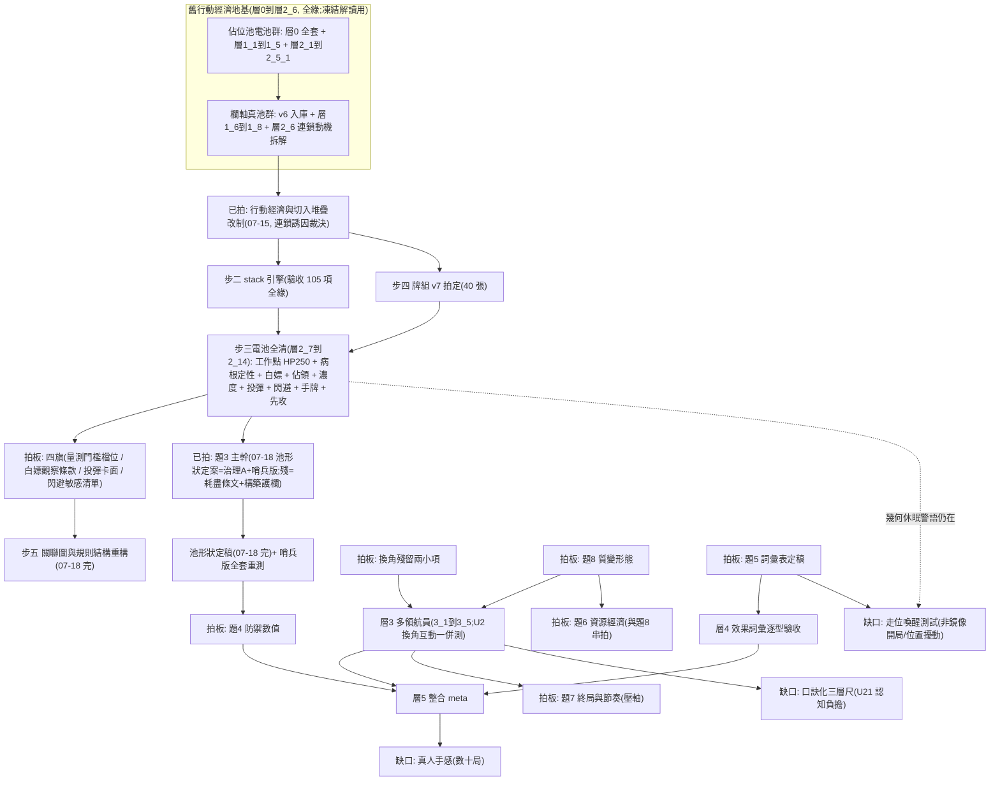

# 驗證索引

> 證據層：拍板不靠手感、靠數據（工作準則見專案 CLAUDE.md「數值以模擬器為準」）。**本檔＝層級測試的唯一總覽**（2026-07-17 重建：原「活區表＋層×題對照表」兩表併一）——一列＝一個測試，新測試落檔即補一列。**三軸制（2026-07-19 user 拍）：資料夾＝成熟度五層（0_引擎運作／1_機制驗證／2_對局測試／3_領航員測試／4_多領航員測試）、檔名＝脈絡_X_Y（`_X_0`＝根測試、`_X_Y`＝由它延伸、新世代重測＝新根 X+1）、世代＝frontmatter 量測戳記**；層N_序＝測試ID 住標題與戳記；世代×駕駛×主題一覽＝[[0_測試台帳.base]]（Obsidian Base 即時讀戳記、缺戳記視圖＝防再犯）；階梯設計原型＝`9_系統/模型規格_sim_v2.md` §六、變因掛題＝框架 §四；實際執行紀錄以本表為準。

## 語義分代表 → 權威已遷 [[4_引擎與世代演進]]（2026-07-19；含引擎家族演進脈絡與改版原因）

**讀任何數字前先分代**。六代速記（新→舊）：**池定案（現行）**→聯集→手8×HP250→舊行動經濟（欄軸 v6／佔位池）→舊框架（絕對數字禁直引）；逐測試世代標記＝frontmatter 量測戳記、總覽＝[[0_測試台帳.base]]「依世代」視圖；完整表與引用規矩＝[[4_引擎與世代演進]] §二。

## 共同語言與權威檔（讀報告前）

| 檔案 | 它是什麼 | 用途 |
|---|---|---|
| [[1_名詞解釋]] | 測試共用名詞（六量／量測口徑／對局版口徑／步三補充） | 讀任何報告前的共同語言；新名詞先入此檔再沿用 |
| [[2_模組定義]] | 現行權威：工作點（§一）／牌組 v7（§二）／詞條表（§三）／駕駛家族與儀器沿革（§四）／佔位池時代模組（§五） | 測試的可掛載模組；結論引用一律標駕駛與池版本 |
| [[3_傷害模型]] | 傷害子系統合併檔：模型＋實測紀錄＋線圖 | 引擎 resolve_attack 骨架；題4 數學地基（閃避線＝無消耗舊語義、額度版待重繪） |
| [[4_引擎與世代演進]] | 引擎家族四代＋世代分代表的敘事權威（演進脈絡／版本差異／改版原因） | **讀任何數字前先分代**；世代轉換因果鏈與讀數守則 |

## 層級測試總表（唯一總覽；一列＝一測試）

### 新行動經濟（stack 引擎；步三電池 2026-07-17 全清）

| 階梯項 | 測什麼 | 掛哪題／U | 結果 |
|---|---|---|---|
| 層2.7 時長×HP 重校準（步三起點） | stack 引擎 HP 八檔掃描＋複驗（v6 池＝設計輸入） | U12／U20／題7 | ✅ [[工作點_3_0_新行動經濟時長與HP重校準]]——工作點候選 HP250；U20 不成立；連鎖生態警訊（鏈均 1.31、69% 行動單張）→exploit 電池 |
| 層2.7.1 工作點 v7 重錨 | 池 v7 定稿後同款掃描 | U12／題7 | ✅ [[工作點_3_1_工作點v7重錨]]——**HP250 續用**（中位 7、300 備選）；先攻 48.3%；鏈均 1.40 |
| 層2.8 exploit 電池 | 門檻{1–4}×切入{必切／不切／大牌才切}＋白嫖切入四變體 | U1／連鎖誘因（病根分離） | ✅ [[剝削掃描_2_0_exploit電池門檻切入與白嫖]]——**湊不出為主因**（天花板 1.75）、被切拆掉 0.36 張；**留牌雙輸**；門檻 1 剝削標準 54.8%（⚑待拍）；**白嫖全開 59.7%→觀察條款候補**（⚑待拍） |
| 層2.9 佔領回合數與續命 | 時效{2/3/4}×佔領三通道＋事件流存活量測 | U16／時效暫定值 | ✅ [[佔領_2_0_佔領回合數與續命]]——佔領微虧不崩（47.9–49.2%）；**三檔平衡等價→暫定 3 續用**；續命延壽≈0；時效非白嫖放大器 |
| 層2.10 逆解與屏障濃度 | 逆解{0/4/8}＋天敵對照格＋防護{2/4/6}×白嫖 | U18／屏障載體上限 | ✅ [[屏障_1_0_逆解與屏障濃度掃描]]——非位移逆解劑量惰性；**位移面禁逆解維持**（天敵順手用 54.1%）；屏障白嫖上限約 57%＝載體非危險旋鈕 |
| 層2.11 投彈真值第三版 | 上界／真值／淨值三格 | U17／投彈定價 | ✅ [[投彈_1_0_投彈真值第三版]]——**真值 1%＝幾乎歸零**（知情必逃）；躲彈淨值 55.8%；死卡方向→調池議程（⚑待拍） |
| 層2.12 閃避相對強度 | 額度{1–4}鏡像＋非對稱邊際 | U13／題4 敏感清單 | ✅ [[閃避_1_0_閃避相對強度]]——每格邊際 2.8–16 點、凹遞減＝**最陡防禦旋鈕之一**（⚑進題4 敏感清單）；閃 3 續用 |
| 層2.13 手牌與循環節奏 | 手牌{6/8/10}鏡像＋洗回觀察器 | U14／題3（牌庫／洗回） | ✅ [[循環節奏_1_0_手牌與循環節奏]]——**洗回三檔全 0＝循環牌庫在工作點局長下不觸發**（題3 硬前提）；手牌＝陡旋鈕＋「湊不出」最便宜緩解候選 |
| 層2.14 先攻公平重測 | 鏡像 n=10000＋局長分層 | U15／公平驗收 | ✅ [[公平_2_0_先攻公平重測]]——48.9%、CI 全落 50 下＝**微偏後攻結構性但帶內**（約 1 點）；無補償必要 |
| 層2.15 手牌×HP 聯掃 | 手{8/10}×HP{250/300/350}＋選點複驗 | 鏈過短方案甲／工作點候選 | ✅ [[工作點_4_0_手牌與HP聯掃]]——手 10 增益重錨後保留（鏈均 1.45–1.47、切入 +2–3／場）；**候選＝手10×HP350（帶中）**、HP300 貼下緣；增益＝緩解級非解方級 |
| 層2.16 代碼表調整掃描 | 治理A/B＋補鏈＋雙管（池改碼） | 鏈過短方案乙／白嫖治理（U1） | ✅ [[代碼治理_1_0_代碼表調整掃描]]——**治理實證成功**（佔領移出 K＝白嫖 54.1→50.9 帶內、治理A 已足）；補鏈鏈均僅 +0.05；**代碼表＝強度旋鈕**（卡面全同、改碼值 +4 點） |
| 層2.17 方向自由度新制重測 | 僅升冪／自由／不對稱鏡像＋白嫖探針 | 鏈過短方案丙／觀察條款 | ✅ [[方向自由度_2_0_方向自由度新制重測]]——**方案失敗**：鏈均反降（1.39→1.33–1.34）＝切入資格同步放寬、拆鏈面吃得更多；**維持僅升冪** |
| 層2.18 投擲舊規窗口對照 | 甲乙案×投彈切手×{標準／避彈} | U23 顧慮驗證／投彈定位 | ✅ [[投彈_1_1_投擲舊規窗口對照]]——甲案切入通道 98–99% 必中但占比僅 22–26%；**會躲世界＝切入變唯一可靠通道→乙案預防必要**；死卡問題與時鐘無關 |
| 層2.19 投彈範圍與傷害掃描 | 爆區{十字/3×3/臂長2}×傷害{50/80}×{避彈/標準} | 投彈卡面拍板供料 | ✅ [[投彈_1_2_投彈範圍與傷害掃描]]——形狀＝真值主旋鈕（1.5→43→51%）；**3×3 進目標帶、臂長2 過強**；傷害不動真值；爆區越大稅越少（稅轉期望傷）；**建議卡面＝3×3×80** |
| 層2.10.1 屏障白嫖機制 | {切入出場/行動出場/誘餌反制}×白嫖探針 | 屏障破線歸因（治理供料） | ✅ [[屏障_1_1_屏障白嫖機制]]——**本體公道（行動出場 50.6）、超額全來自免費出場（58.4）**；無行動層反制窗（回合門禁）；治理=移碼優先、詞條不動；與佔領白嫖同構 |
| 層2.10.2 防護移碼治理 | {對照/單移B→X/雙移BX+LY}×白嫖探針＋鏡像中性 | 屏障白嫖收口（題3 供料） | ✅ [[屏障_1_2_防護移碼治理]]——三選項：雙移全孤立 49.3／**哨兵版 52.3（防護只鄰孤立碼晶片＝專剋冰浪竹槍、逆解保命）**／現行 58.4 破線；單移不夠 54.8；生態中性；每次免費出場 ≈+11 點 |
| 層2.21 期望值型駕駛A/B | {期望值γ家族/修正版}×{門檻1/門檻2/鏡像公平分層} | 量測標準定案＋先攻公平機制 | ✅ [[駕駛儀器_1_0_期望值型駕駛AB]]——**修正版收斂門檻1（留牌 0、對打 50.1 全平）＝補滿制下囤牌結構性無利**；最優 meta 先攻 46.7%（帶外）＝**公平問題為真、補償議題成立**；γ0.9 鏡像 51.4 帶內但不穩定（被全倒 39.1 剝削）；標準建議＝門檻1 |
| 層2.20 鏈過短矩陣 | {基線/手10×HP350/治理A/聯集}×{鏡像生態/白嫖探針} | 鏈過短組合拍板供料（user 裁先測後拍） | ✅ [[鏈過短_1_0_鏈過短矩陣]]——**兩帖藥正交、聯集可當一件事拍**：鏈全來自手10×HP350（平均鏈長度 2.33→2.74）、收口全來自治理A（白嫖 53.2→51.1、手10 下不反彈）；切入密度 +54%（U21 權重升）；仍緩解級 |
| 層2.22 極端構築掃描 | 八型極端牌組（代碼極端×4＋卡面極端×4）×{對標準池/循環賽} | 題3 構築護欄供料 | ✅ [[構築_2_0_極端構築掃描]]——**五型破線、開放構築必須護欄**：全同碼 86.9/87.6=碎裂級（切入擋不住）、連續梯3 77.7（配對率不是對的尺→期望段長）、多打數 68.4；斬系 54.9 貼線、高傷 38.2=自懲；複本軸降級（5 副本<3 副本梯）；集中橫掃舊結論翻轉；八格四偏＝認知更新大 |
| 層2.23 洗回縮手模擬 | 甲觸發率／乙收斂性（開關對照）／丙拖牌差 | 題3 耗盡條文（[[發想_洗回縮手]]） | ✅ [[循環節奏_1_1_洗回縮手模擬]]——**軟時鐘假說死於觸發率鴻溝**（防禦偏置 cap60 也只 0.9%＝醒不來）；**真長局=死鎖型（牌不消耗）→題7 職權**；丙過（無龜縮紅利 +0.9）；耗盡條文=平衡等價的語義品味題供裁 |
| 層2.24 力場帶重掃 | 場 {5/10/15} 非對稱＋鏡像節奏（層2_1 後繼） | 題4 力場天花板（前置補測） | ✅ [[力場_1_0_力場帶重掃]]——**力場=王牌級**：場5 單側 86.6%／場10 98.2／場15 99.9；雙場10 鏡像中位 12=出帶；**天花板 10 以上不建議開放**；五格四偏＝力場直覺全面失準 |
| 層2.25 護欄值掃描 | K 碼 {5/8/12/16/24/36} 劑量曲線＋期望段長量尺 | 題3 構築護欄定值 | ✅ [[構築_2_1_護欄值掃描]]——破線點 ≈ **K10–12**；**期望段長單調可用（4.47→10.0）**＝構築驗證器門檻候選 ≤4.7 上下；統一量尺優於土規則再一證 |
| 層2.26 儀器敏感度複驗 | RichStack（幾何感知駕駛 stack 版）×{標準鏡像/斬系/高傷/場5} A/B | 儀器校驗＋層2_22/2_24 複驗＋[[發想_移動誘因]] | ✅ [[駕駛儀器_2_0_儀器敏感度複驗]]——**幾何智慧現行規則=零加值（50.4）＝假選擇實錘**；層2_22/2_24 結論全穩；位移進攻=新行動經濟價值陷阱（調參待辦）；⚠️ **智對智=另一 meta**（局長+2–3、斬系 61.8 破線、機制待拆）→拍板級結論建議加智對智複驗格 |
| 層2.27 移動成本變體掃描 | {現行/首步免費/全免費}×{中央/錯列} 鏡像（FreeMover） | [[發想_移動誘因]] 丙層（user 裁誘因×成本最重要） | ✅ [[移動成本_1_0_移動成本變體掃描]]——雙智世界移動基線=15/場（量隨駕駛世代、質仍單一正解）；⭐ **首步免費=節奏潤滑＋死鎖解藥**（p90 17→12、截斷 3.2→0.0%）＝條文化候選供拍；全免費否決（44/場=灌水）；**成本歸零沒創造「值得站的地方」＝誘因層維持主力** |

### 舊行動經濟（l1／grid 凍結儀器；解讀用、絕對數字標代）

| 階梯項 | 測什麼 | 掛哪題／U | 結果 |
|---|---|---|---|
| 層0.1/0.2/0.4 驗收 | 引擎＝條文（連鎖／迴圈／結算） | — | ✅ [[引擎驗收_1_0_連鎖組合與結算]]（33 項＋死角矩陣） |
| 層0.3 連鎖組合 | 成鏈率／成鏈度（第一手地板） | 題3 代碼規模 | ✅ 同上——連鎖密度主宰＝複本數、非字母表 |
| 層0.5 死角矩陣 | 閃避額度×力場門檻 | 題4 帶值 | ✅ 同上 |
| 層0 補測：米號 | 米號語義驗收＋張數掃描 | 題3 米號張數 | ✅ [[米號切入_1_0_米號牌與切入時機]]——切入計數甲案驗收 |
| 層0 補測：組牌傾向 | 傾向×相關性（地板） | 題3 組牌傾向 | ✅ [[組牌傾向_1_0_組牌傾向與相關性]] |
| 層0 總掃描 | 六量×六變因主宰因子表 | 題3 全案＋題4 方向 | ✅ [[代碼總掃描_1_0_代碼子系統總掃描]]——成鏈率非旋鈕；米號＝切入總開關 |
| 層1.0 引擎驗收 | 對局引擎＝條文（25 項） | — | ✅ [[引擎驗收_2_0_對局引擎]] |
| 層1.1 回合收斂 | 對局長度／上限／無限局 | 題7；題2/4 HP 尺度 | ✅ [[工作點_1_0_回合迴圈收斂]]（佔位池工作點 HP350＝6–10 帶） |
| 層1.1.1 時長調校 | 假體 HP→回合帶（6–9） | 題7／題2/4 | ✅ [[工作點_1_1_時長調校]]（佔位池拍定 HP350） |
| 層1.2 先手公平 | 先攻勝率軌跡 | 題1 收官 | ✅ [[公平_1_0_先手公平]]——交替＝公平主承重牆；拿掉洗二＝歸零 |
| 層1.3 牌組電池 | 傾向×配對＋逐回合六量 | 題3 主證據；題1 補遺 | ✅ 三檔全結：[[連鎖生態_1_0_平衡型調鏈長]]／[[構築_1_0_牌組組法電池]]（相剋表；代碼重疊＝切入總開關）／[[公平_1_1_後攻微利拆解]]（微利＝洗二過補） |
| 層1.4 風箏消耗戰 | 行動數上限旋鈕探測 | 觀察條款 | ✅ [[風箏_1_0_風箏消耗戰]]——風箏自懲；旋鈕不啟用 |
| 層1.5 回復收斂 | 回復濃度×全洗回 | 題3／題7 | ✅ [[回復_1_0_回復收斂]]——不收斂證實；主動回復＝優勢策略（舊制 97–100%） |
| 層1.6 佔領小驗證 | 佔領時效 N 8/12/16×佔領 meta | 佔領條文 | ✅ [[佔領_1_0_佔領小驗證]]（v6 欄軸；N 維持 12、佔領不虧） |
| 層1.7 真池 HP 短掃 | v6 池 HP 330–530 | 工作點校準 | ✅ [[工作點_2_0_真池HP短掃]]（v6 工作點 HP330＝已作廢、解讀用） |
| 層1.8 真池全電池 | 三缺口複驗＋使用面＋米號敏感度 | 連鎖誘因（真池證據）／題3 | ✅ [[綜合電池_1_0_真池全電池]]——搶攻 93.2 惡化；投彈 89%＝盲點高估 |
| 層2.1 防禦帶掃描 | 閃／盾／場帶值 | 題4 | ✅ [[防禦帶_1_0_防禦帶掃描]]——**力場一步＝半場勝負**；加性預算尺崩壞 |
| 層2.2 池形狀初掃 | 廢牌偵測／實效稅 | 題3／題4 | ✅ [[池形狀_1_0_池形狀初掃]]——實效稅表；**幾何休眠警語**（鏡像開局＝移動休眠） |
| 層2.3 方向自由度對照 | 僅升冪 vs 自由 vs 不對稱 | 觀察條款 | ✅ [[方向自由度_1_0_方向自由度對照]]——體感旋鈕非平衡旋鈕；可維持僅升冪 |
| 層2.4 米號強度電池 | ＊濃度×效果定價 | 題3（池硬約束） | ✅ [[米號定價_1_0_米號強度電池]]——**安全帶＝米號名目 ≤ 池均之半**；張數＝互動軸 |
| 層2.5 駕駛 exploit 格點 | 門檻×切入×回復 24 變體 | 觀察條款複驗 | ✅ [[剝削掃描_1_0_駕駛exploit格點]]——⚠️ 搶攻輾壓 91%+＝連鎖誘因缺口實錘（→2_5_1） |
| 層2.5.1 連鎖誘因候選 | 條文候選 9＋組合 3 | 連鎖誘因 | ✅ [[連鎖誘因_1_0_連鎖誘因候選掃描]]——全數不及格；可行解＝質變級→07-15 拍行動經濟改制 |
| 層2.6 連鎖動機拆解 | 池結構／留牌價格／報酬三原型／exploit×新舊儀器 | 連鎖誘因（方向供料）／題3 | ✅ [[連鎖誘因_1_1_連鎖動機拆解]]——報酬貼皮死路；新儀器把搶攻壓回 55.1%；投彈真值二版 19.7% |

### 排定（未開）

| 階梯項 | 測什麼 | 前置 | 狀態 |
|---|---|---|---|
| 層3.1–3.5 多領航員 | 換角／質變／掉員／終局（含 U2 換角×晶片互動） | 換角殘留拍板＋題8 | 排定 |
| 層4 效果詞彙 | 逐型開放驗收 | 題5 詞彙表定稿 | 排定 |
| 層5 整合 meta | 池形狀→權重→角色數值 | 題3＋題4＋層3＋層4 | 排定 |

## 舊框架三波（2026-07-05–10；**2026-07-19 user 令已全數搬 `9_系統/_歷史/`**）

導讀與結論五檔＋三個存檔夾整包封存：4/5（三方向）、6/7（第二波）、8（機率制重跑）——現住 `9_系統/_歷史/`。

**引用守則**：
- **機制性洞察仍可援引**——安全網病根＝幾何拒止而非拖延、定價迴歸方法、三層驗收尺、換角回復牆的結構性論證等。
- **絕對數字一律標舊語義**，不可直接套新制（行動槽／無消耗閃避／舊帶值／舊「回合」定義）。
- 要從存檔撈殘值，先過 `9_系統/_歷史/_機率制重跑存檔/F1_數字宣稱校核.md` 與 `F1_程式路徑校核.md`——這批資料自身的可信度裁決表。
- 換角條文**活檔**：`9_系統/_歷史/_第二波驗證存檔/裁量_B1.md`（確立項與題4 引用；「閃避無狀態」一條已被額度制取代；2026-07-19 隨歷史搬遷移位、活檔地位不變）。

## 測試依賴圖與前置需求（先測什麼、才能測什麼）

> 2026-07-12 建、2026-07-17 重畫（步三全清版）。**看圖找「進邊全數滿足的節點」＝當下可動工的事；「缺口」節點＝未來拓展方向**。維護規則：新測試落檔＝總表補一列＋本圖補節點與邊；拍板落檔＝對應閘門節點改註「已拍」。

### 讀圖三句話

- 步三電池全清之後，**每條前進路徑的閘門都是拍板**（四旗／題3／題8／題5／換角殘留）加一個要 user 在場的重構工作（步五）——瓶頸在決策、不在算力。
- 新行動經濟基線已立（HP250、先攻 48.9% 帶內、病根定性＝湊不出為主）；層3 等換角殘留與題8；**條文有動→步三電池重跑**（腳本全在庫、全套分鐘級）。
- 「缺口」節點＝階梯之外、看圖才浮出的拓展方向：走位喚醒、口訣化三層尺、真人手感。

### 前置需求表（逐項寫「缺什麼才能動」）

| 下一步 | 前置（缺什麼） | 完成後解鎖 |
|---|---|---|
| ~~拍板：四旗~~✅（07-17/18 全裁：門檻1 拍定／白嫖入觀察條款／投彈分卡方向裁＋本輪不動／閃避入觀察） | — | 已解鎖 |
| 步五：關聯圖與規則結構重構 | user 在場（判斷類） | 索引與確立項結構 |
| ~~拍板：題3 晶片供給~~✅（2026-07-18 主幹拍定＝池形狀定案；耗盡條文 ✅ 2026-07-19 拍＝全洗回保底、縮手廢棄；殘＝構築護欄值掃描） | — | 題4 前置已解鎖 |
| 拍板：題8 質變形態 | 無測試前置（品味裁決） | 層3_2/3_3、題6 串拍 |
| 拍板：換角殘留兩小項 | 無 | 層3_1 |
| 層3_1 換角骨架 | 換角殘留拍板 | 層3 全群＋U2 換角×晶片互動 |
| 拍板：題4 防禦數值 | ~~力場帶重掃~~✅（層2_24：天花板 10+ 不建議開放）；剩＝定價迴歸重擬（新池新 meta） | 角色數值、層5 |
| 層4_1–4_4 效果詞彙 | 題5 詞彙表全表定稿（逐型開放逐型測） | 晶片效果空間擴張 |
| 層5 整合 meta | 題3＋題4＋層3＋層4 | 角色圖鑑逐隻數值化 |
| 缺口：走位喚醒 | 測試設計（非鏡像開局／位置擾動）＋題5 移動力值帶 | 幾何休眠解除、移動類晶片定價 |
| 缺口：口訣化三層尺 | 層3 之後（要有多樣真實對局可量） | 存活條 5 首次執行 |
| 缺口：真人手感 | 數位原型（層5 後） | 最終驗收、體感層 |

## 使用時機

- 拍題4 前：[[3_傷害模型]] 配 [[1_設計約束與審查備查]] 存活條。
- 跑新測試：照 `9_系統/標準化平衡測試框架.md` 模板與工序（階梯設計原型＝`9_系統/模型規格_sim_v2.md` §六）；結果落本資料夾，**落檔即補本表一列**。
- 改任何結算規則後：重跑 sim_combat 舊測試＋層0.4 迴歸＋`stack_tests.py` 105 項，數據對不上＝回歸破壞。
- 引擎家族：**現行條文引擎＝`stack_game.py`**（步三起一律用它）；`l1_game.py`／`grid_game.py`＝舊行動經濟凍結儀器（解讀層0–2_6 舊報告用）；傷害核心 `sim_combat.py` 沿用；完整地圖＝模型規格 §五末「引擎家族」段。
