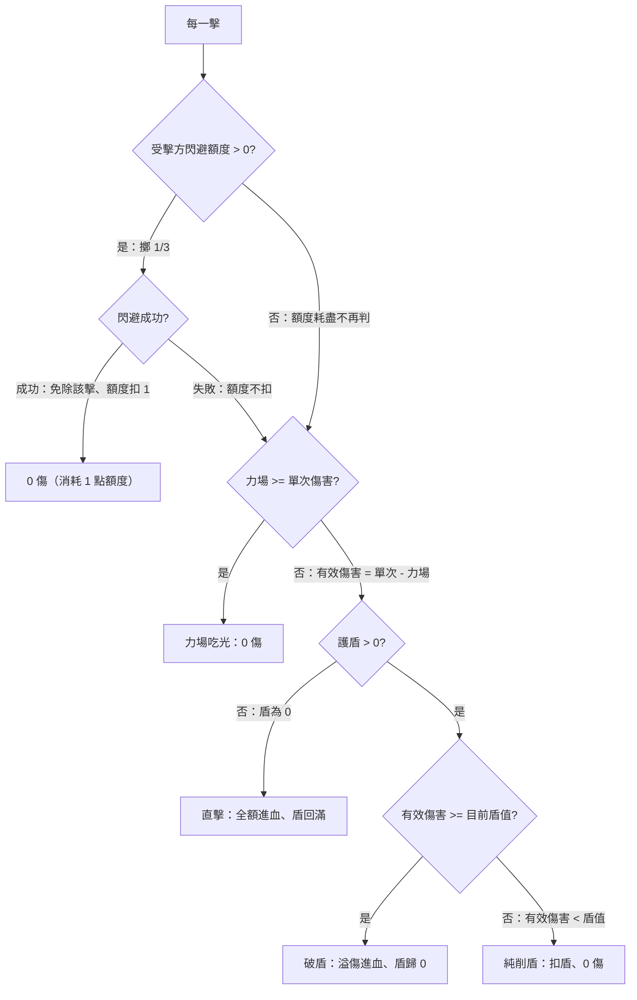

# 傷害模型(合併檔)

> 三檔合併(2026-07-11):原 `3_傷害模型`/`3_傷害模型`/`3_傷害模型` 收成一檔,原檔快照在 `_歷史/`。

## 一、模型與名詞

> 減傷三機制（護盾／力場／閃避）＋打擊數 的結算模型與名詞。三機制屬 [[0_核心確立項]]（數值未定，拍板見 [[題4_防禦數值]]）；實測數據見本檔 §二。

## 名詞定義

| 名詞 | 定義 |
|---|---|
| 單次攻擊傷害（每擊傷害） | 一張攻擊牌「每一擊」的基礎傷害；是 5 的倍數 |
| 攻擊次數（打數） | 一次攻擊打幾擊；攻擊寫成「單次傷害 × 攻擊次數」（如 5×8） |
| 有效傷害 | 單次傷害扣掉力場後的值：單次傷害減力場（最低 0），進入護盾判定 |
| 護盾 | 可吸收傷害的盾；**回充窗**：歸 0 後下一擊全額穿透、該擊之後回滿；**盾量跨回合保留** |
| 破盾 | 把護盾打到 0（或負）的那一擊：盾吃掉一個護盾值、溢傷進血 |
| 直擊 | 護盾為 0 時的那一擊：全額進血，之後盾回滿 |
| 純削盾 | 護盾 > 0 但該擊打不破（有效傷害 < 目前護盾值）：只削盾、0 傷 |
| 力場 | 每一擊先固定減力場值（最低 0）；力場值 ≥ 單次傷害則該擊被吃光 |
| 閃避 | 被攻擊方判定，**額度制**（2026-07-10 新語義）：每次受擊擲 1/3，成功免除該整擊並**扣 1 點額度**、失敗不扣；額度耗盡本回合不再判、下回合回滿；換入的領航員當回合額度為零（見 [[確立項_領航員]]） |

## 單擊結算決策圖

整次攻擊＝每一擊依序丟進下圖（閃避判定含額度消耗、額度每回合回滿）。**2026-07-16 起管線多一層「屏障」**：位置在閃避之後、力場之前——命中才觸發、該擊傷害歸 0（不進力場／護盾）、被歸零的擊仍算命中；細則權威＝[[2_模組定義]] §三 屏障條（本圖未重繪、v7 引擎 `stack_game._hit` 已實裝）：

> 這張圖就是模擬器 `9_系統/scripts/sim_combat.py` 裡 `resolve_attack` 的實際流程，等同日後結算函式的骨架。

## 變數與條件值

| 變數 | 門檻／條件 | 效果 |
|---|---|---|
| 閃避 | 1/3 機率、成功耗 1 額度（前置） | 額度＝每回合的成功次數上限；多發攻擊燒額度、額度盡後後續擊不再判——期望值計算要逐擊帶額度狀態 |
| 力場 | 力場值 ≥ 單次傷害 → 吃光；否則 有效傷害 ＝ 單次傷害 − 力場值 | 每擊先砍一刀，砍到 0 就完全免疫該擊 |
| 護盾 | 有效傷害 ≥ 護盾值 → 破盾；有效傷害 < 護盾值 → 純削盾 | 決定走哪條分支；門檻就是護盾值本身 |
| 攻擊次數奇偶 | 破盾次數 = 攻擊次數除以二、無條件進位（**僅當 有效傷害 ≥ 護盾值**） | 奇數攻擊次數被下一個偶數弱支配（見 本檔 §二 輪3） |

關鍵交互：**「破盾次數 = 攻擊次數除以二、無條件進位」只在 有效傷害 ≥ 護盾值 成立**。一旦 有效傷害 < 護盾值，會走「純削盾」分支、進入逐擊削盾的狀態機（不是乾淨公式）：破一次盾要「護盾值除以有效傷害、無條件進位」擊，一個破盾循環是這個擊數再加 1 擊。

## 二、實測紀錄(多輪驗證,持續累積)

> 用 `9_系統/scripts/sim_combat.py` 模擬跑。每跑一輪就在下方表格加列（一個驗證項目一列）。
> **注意**：模擬用簡單 AI、3 排小盤——方向可信，絕對數值待真人或更強 AI 再校。
>
> **框架加註（2026-07-04）**：本頁數據分兩類。**綁確立項、仍有效**——輪1（護盾結算、相剋基礎）、輪3（等總值不同打數）、演示、線圖（皆屬「傷害乘以次數對三防禦」的結算數學，隨新框架沿用，見 [[0_核心確立項]]）。**綁舊 v1 規則稿、結論轉入備查**——輪2（方案A、移動稅）、點4（牌庫見底分佈）；舊稿見 `9_系統/_歷史/`，備查見 [[1_設計約束與審查備查]]。

## 結論摘要（傷害測試）

- **攻擊形狀的三方相剋**：護盾、力場偏好把總傷集中成大單擊（攻擊次數越少越好）；閃避偏好攤成很多薄擊（攻擊次數越多越好）。護盾與閃避同時存在時，兩股相反張力在中段攻擊次數拉出甜蜜點（護盾較高又疊閃避時約 3 到 4 下）。力場是單純的門檻，不與其他機制形成有趣拉扯。
- **三機制個性**：護盾（回充窗）擋掉＝護盾值×破盾次數，破盾次數＝攻擊次數除以二、無條件進位（僅在有效傷害不小於護盾值時成立；否則進純削盾、要逐擊狀態機算），偏好少打數、且有奇偶不平滑；力場是單次傷害的硬門檻（不超過力場值就整擊歸零）；閃避（每點 1/3）抵銷整擊，對少打數大單擊壓制極強、對多打數幾乎無感。
- **沒有萬用攻擊形狀**：固定總傷害下，沒有任何「單次傷害×攻擊次數」切分能同時對所有防禦最好——出招前要先判斷對手防禦。
- **平衡風險（待後續）**：不設攻擊上限時，極端「大單次傷害×多攻擊次數」會壓過所有防禦、相剋失效；固定減傷對大數值的百分比保護會崩；力場過高整類廢掉低單次傷害卡；閃避過高對單擊近乎免疫。
- **初步數值帶**：力場 5–15、護盾 5–30、閃避 0–6（每點 1/3），皆 5 的倍數；單次傷害與攻擊次數需設相近的有效上限，避免單軸獨大。

---

## 驗證紀錄（持續累積）

| 輪次 | 驗證項目 | 條件／設定 | 結果（數據） | 結論／下一步 |
|---|---|---|---|---|
| 輪1 | 護盾結算驗證 | 原案回充窗、無閃避 | 5×8→20、20×2→35、40×1→35、10×4→30、40×1無盾→40 | 與原案一致 ✓ |
| 輪1 | 相剋三角（基礎） | 4 形狀 × 護盾/閃避 | 護盾↓多段（5×8:20/10）、閃避↓重擊（40×1:22/12）；混合防禦→中庸形狀最優（20×2/10×4 ~25） | 相剋成立 ✓ |
| 輪1 | 拖延重現 | 牌庫輪轉、無反制 | 高機動拖延 vs 進攻＝113 回合（拖延者 0 勝）；進攻vs進攻＝8 回合 | 拖延非無敵、但拖長 14 倍 |
| 輪1 | 反拖延候選 | 流血鐘 / 被動懲罰 / 回收衰減 | 被動懲罰最佳（113→24、0 勝、不誤傷）；流血鐘讓拖延者偶爾躺贏（6%）；回收衰減慢（99）漏 16% | 候選暫記 |
| 輪2 | 後手補償 方案A | 先手第一回合禁打傷害 | 先手勝率 62.7%（無A）→ 18.8%（有A） | **過度補償**、需調或改輕量補償 |
| 輪2 | 反拖延 移動稅 | 過 8 回合後每次移動扣血（每 4 回合 +1） | 高機動拖延 113→37 回合、拖延者 0 勝；進攻vs進攻 8 回合**不變**（不誤傷） | 有效且不誤傷正常局；要更快可把 遞增幅度 調陡 |
| 輪2 | 重擊定位（40×1） | 加入「力場＝每擊固定減傷」防禦型 | 力場-15：40×1=25、20×2=10、10×4=0、5×8=0 | 力場是大重擊的剋星 → 40×1 有了定位；三種防禦各剋一種攻擊形狀 |
| 輪3 | 等總值 × 不同打數 | 護盾回充窗，總值 60／120 掃 x1–x8 | 護盾欄相鄰打數兩兩同值（x1=x2、x3=x4、x5=x6）；閃避欄打數越多越優 | 「奇數打數被下一個偶數弱支配」、偶→奇為健康取捨；屬小瑕疵（僅閃避方在場才差） |
| 演示 | 逐擊傷害演示＋門檻掃描 | `demo()`：20×2／5×8／3×6 對盾，12×3 帶力場；盾10打數6 掃單擊傷害 | 破盾／直擊／純削盾交替如預期；每擊≥盾(10) 時破盾次數=3=攻擊次數除以二、無條件進位（即破盾次數），每擊<盾則純削盾登場、破盾次數下降 | 結算邏輯成立、可視化為決策圖（見 [[3_傷害模型]]）；名詞定義已立 |
| 線圖 | 單機制傷害線圖（閃避每點 1/3） | 總傷 20/30/50/80/120 × 攻擊次數(合法值) × 護盾0–30／力場0–15／閃避0–6，單機制各自變 | 護盾、力場：傷害隨攻擊次數遞減（剋分散）；力場有「單擊≤力場值即歸零」懸崖；閃避：遞增（剋集中） | 三張線圖見本檔 §三；閃避機率每點 1/3 |
| 點4 | 牌庫見底分佈（反拖延必要性） | 100血／24張不洗回／現行傷害帶；進攻vs進攻＋拖延＋減傷掃描，各 3000 局（牌庫約第 38 回合見底） | 進攻vs進攻 0% 見底（中位 8 回合）；拖延vs進攻 29%；雙方龜 100%；護盾20閃4 使進攻局也 95% 見底 | 正常局不會見底→輪轉替除是解假問題；拖長旋鈕是減傷／傷害／血量、流血鐘當安全網（見 [[2_設計反思]] 點4） |

> 下一輪可填：方案 A 的輕量替代（B 偷看／C +血量／調整版 A）、移動稅 遞增幅度 調校、力場與閃避作為角色特性的勝率、真人對局抽樣。

## 三、傷害線圖

> 橫軸＝攻擊次數、縱軸＝期望最終傷害。一張圖一種防禦機制，內分五個總傷害面板（20／30／50／80／120），每條線是一個防禦值。資料由 `9_系統/scripts/draw_charts.py` 產生（閃避用每點 1/3 的精確期望）。
>
> 前提：傷害寫法為單次傷害 × 攻擊次數，單次傷害是 5 的倍數（總傷害除以攻擊次數須為 5 的倍數）；總傷害不超過護盾值的組合不畫；攻擊次數取 1、2、3、4、5、6、8、10、12 裡合法的值。

## 一、單機制（其他兩種歸零）

### 護盾

![[DIGO_EXE_線圖_護盾.png]]

傷害隨攻擊次數**遞減**——護盾剋分散，集中成大單擊最有利。護盾值越高整條線越低；單次傷害小於護盾值時還會掉進純削盾、傷害更低。

> 護盾＝回充窗：擋掉的傷害＝護盾值 × 破盾次數，破盾次數＝攻擊次數除以二、無條件進位。此式僅在「有效傷害 ≥ 護盾值」時成立；有效傷害小於護盾值時進入純削盾，要逐擊用狀態機算、沒有乾淨公式。

### 力場

![[DIGO_EXE_線圖_力場.png]]

遞減更陡，而且有**懸崖**：單次傷害一旦不超過力場值，該形狀直接歸零（例如總傷害 20、力場 15：打 1 下還有 5 傷、打 2 下起就是 0）。力場剋分散最狠——它就是單次傷害的門檻，不超過力場值就整擊歸零。

### 閃避

![[DIGO_EXE_線圖_閃避.png]]

傷害隨攻擊次數**遞增**——閃避剋集中，攤成很多下最有利（每點 1/3）。閃避值越高整條線越低，但打數越多越能拉回（被抵銷的整擊佔比變小）。

## 重點

護盾、力場偏好少打數（大單擊）；閃避偏好多打數（薄擊）——攻擊形狀的三方相剋在線圖上就是「遞減」對「遞增」兩個方向。

> 減傷三機制（護盾／力場／閃避）是現行設計（數值待定）：機制已採用，初步數值帶仍在調（見本檔 §二）。

## 二、兩兩搭配：護盾 × 閃避（總傷害固定 120）

![[DIGO_EXE_線圖_護盾x閃避_總傷120.png]]

總傷害只影響格點密度、不改變趨勢，所以固定取最大的 120（格點最細）。每個面板一個護盾值、每條線一個閃避值（力場 0）：

- 護盾 0 那格＝純閃避，所有線都遞增（多打數最好）。
- 護盾越高，曲線從「遞增」一路轉成「先升後降的駝峰、甚至遞減」——閃避要你多打數、護盾要你少打數，兩股相反張力在中段的攻擊次數拉出甜蜜點。
- 護盾 20 以上又疊閃避時，最佳攻擊次數明顯落在中段（大約 3 到 4 下）。

> 力場不另外畫：它就是「單次傷害不超過力場值就歸零」的門檻，單機制圖已說清楚；與其他機制搭配只是把每條線整體往下平移或截斷，趨勢不變。護盾與閃避是唯一會互相拉扯的一對，本圖即等於三機制裡值得放一起比的部分。
