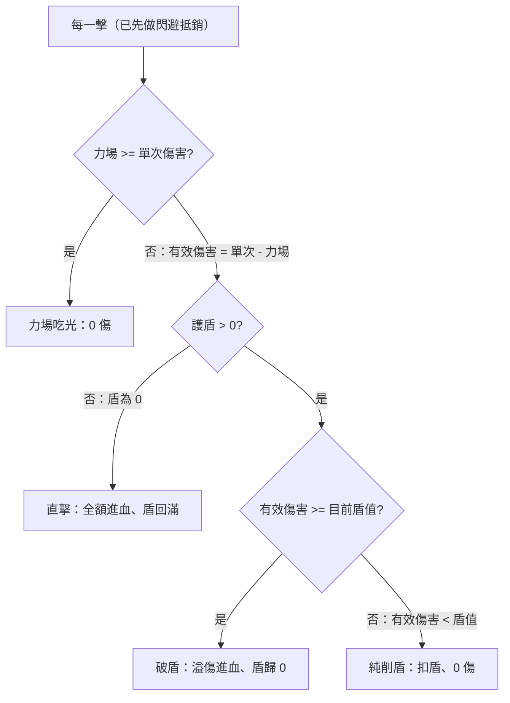

# 傷害模型（探索中）

> 減傷三機制（護盾／力場／閃避）＋打擊數 的結算模型與名詞。三機制屬 [[0_核心確立項]]（數值未定，拍板見 [[題4_防禦數值]]）；實測數據見 [[4_實測紀錄]]。

## 名詞定義

| 名詞 | 定義 |
|---|---|
| 單次攻擊傷害（每擊傷害） | 一張攻擊牌「每一擊」的基礎傷害；是 5 的倍數 |
| 攻擊次數（打數） | 一次攻擊打幾擊；攻擊寫成「單次傷害 × 攻擊次數」（如 5×8） |
| 有效傷害 | 單次傷害扣掉力場後的值：單次傷害減力場（最低 0），進入護盾判定 |
| 護盾 | 可吸收傷害的盾；**回充窗**：歸 0 後下一擊全額穿透、該擊之後回滿 |
| 破盾 | 把護盾打到 0（或負）的那一擊：盾吃掉一個護盾值、溢傷進血 |
| 直擊 | 護盾為 0 時的那一擊：全額進血，之後盾回滿 |
| 純削盾 | 護盾 > 0 但該擊打不破（有效傷害 < 目前護盾值）：只削盾、0 傷 |
| 力場 | 每一擊先固定減力場值（最低 0）；力場值 ≥ 單次傷害則該擊被吃光 |
| 閃避 | 被攻擊方判定，每點 1/3 機率抵銷一整擊（前置、機率） |

## 單擊結算決策圖

整次攻擊 = 先做閃避抵銷，再把剩下的每一擊逐一丟進下圖：

> 這張圖就是模擬器 `9_系統/scripts/sim_combat.py` 裡 `resolve_attack` 的實際流程，等同日後結算函式的骨架。

## 變數與條件值

| 變數 | 門檻／條件 | 效果 |
|---|---|---|
| 閃避 | 每點 1/3 抵銷一擊（前置、機率） | 期望抵銷 閃避值÷3 擊；打數越多被抵銷比例越小 |
| 力場 | 力場值 ≥ 單次傷害 → 吃光；否則 有效傷害 ＝ 單次傷害 − 力場值 | 每擊先砍一刀，砍到 0 就完全免疫該擊 |
| 護盾 | 有效傷害 ≥ 護盾值 → 破盾；有效傷害 < 護盾值 → 純削盾 | 決定走哪條分支；門檻就是護盾值本身 |
| 攻擊次數奇偶 | 破盾次數 = 攻擊次數除以二、無條件進位（**僅當 有效傷害 ≥ 護盾值**） | 奇數攻擊次數被下一個偶數弱支配（見 [[4_實測紀錄]] 輪3） |

關鍵交互：**「破盾次數 = 攻擊次數除以二、無條件進位」只在 有效傷害 ≥ 護盾值 成立**。一旦 有效傷害 < 護盾值，會走「純削盾」分支、進入逐擊削盾的狀態機（不是乾淨公式）：破一次盾要「護盾值除以有效傷害、無條件進位」擊，一個破盾循環是這個擊數再加 1 擊。
